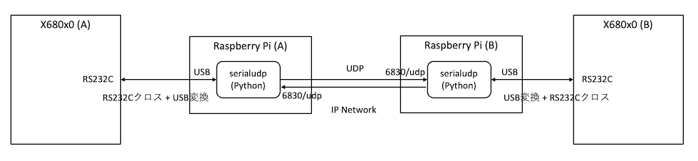
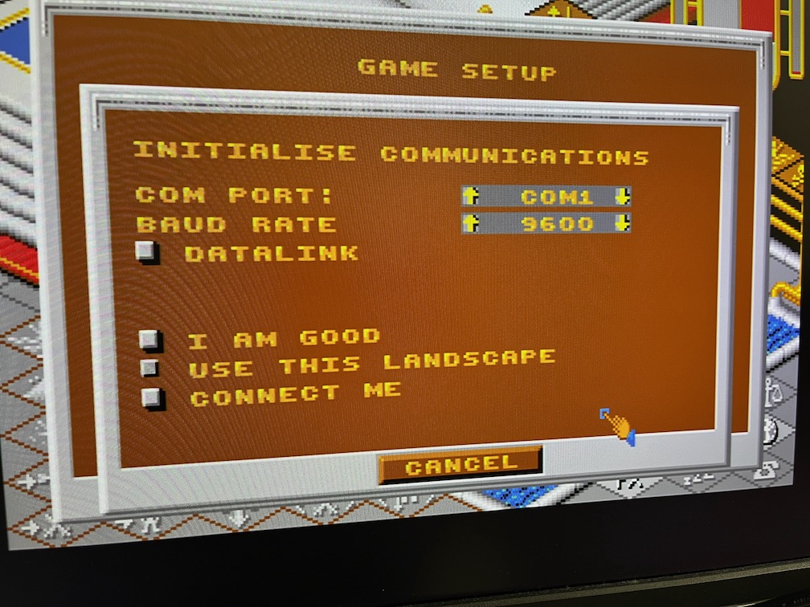
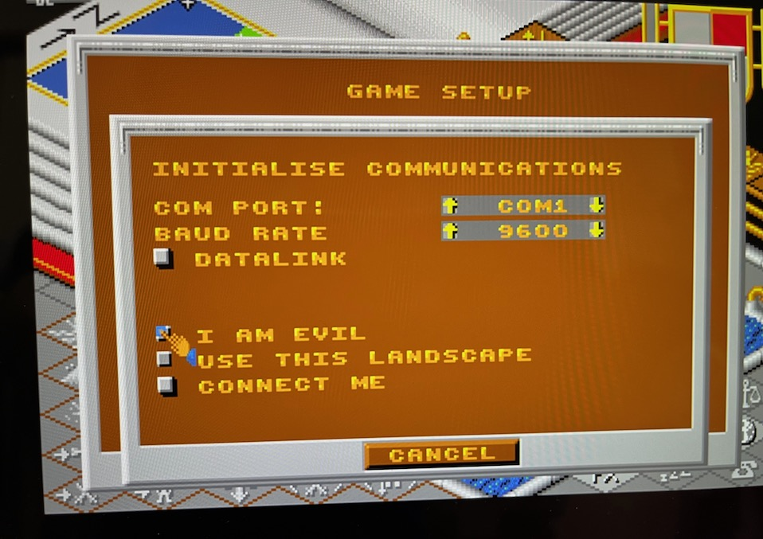
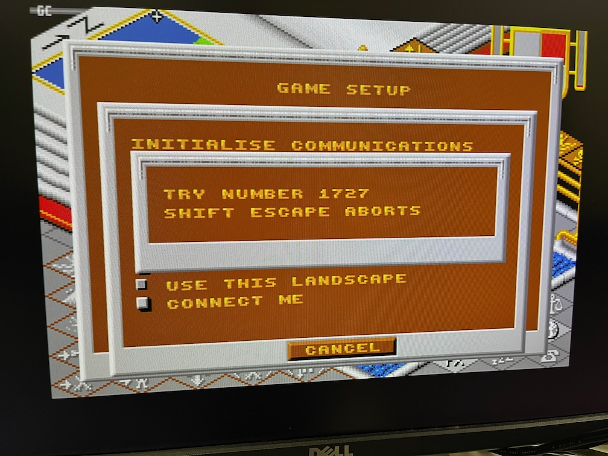
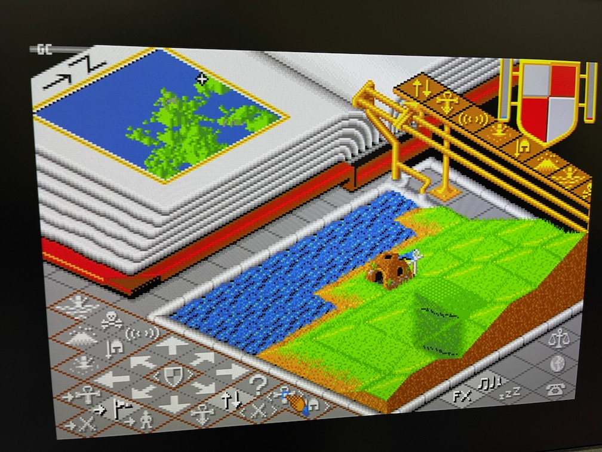
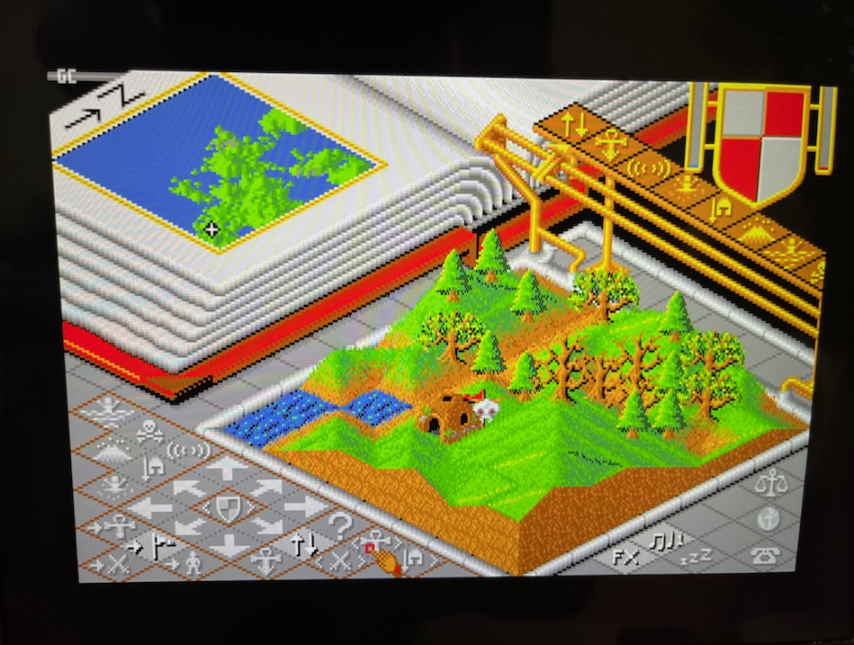

# serialudp

RS232C(UART) serial communication gateway over UDP in Python

---

## About This

これは1:1の RS232C(UART) シリアル通信を UDP を使ってIPネットワーク越しに行うためのゲートウェイサーバアプリケーションです。

Pythonで書かれているため、IPネットワークに接続されているPythonが動作する環境であればLinux,macOSなどOSを問わずに動かすことができます。ただし、Windows OSでは動作しないかもしれません。(selectorsモジュールを使っているため)

主たるユースケースとして、RS232Cクロス通信を使うレトロPCの通信対戦ゲームをLAN、あるいはインターネット越しに実現することを想定しています。(下図)

以下の説明では X680x0 のRS232Cクロス接続対戦ゲームを Raspberry Pi を使用してIPネットワーク越しに行う前提で記述してあります。適宜読み替えてください。

---

## 注意

このアプリケーションを利用してインターネット越しの通信を行う場合、相手方にグローバルIPとポート番号を伝える必要があります。
安易にSNSなどにグローバルIPやルータ・回線の種類などを書き込まないようにしましょう。攻撃の対象あるいは踏み台にされる可能性があります。

---

## 準備するもの

以下の構成が通信相手と自分と双方に必要です。

- ケーブル
  - RS232Cクロスケーブル(25pin-9pin)
  - USB-Serial変換ケーブル

- Raspberry Pi 3A+/3B+/4B のいずれか (2/Zeroは所有していないので不明)
  - Raspberry Pi OS が導入済であること (最新の32bit OS Liteでのみ確認)
  - インターネットに接続されていること
  - USB-SerialおよびRS232CクロスケーブルでX680x0実機と接続されていること
  - `/dev/ttyUSB0` が見えていること

- X680x0 実機
  - RS232CクロスケーブルおよびUSB-SerialケーブルでRaspberry Piと接続されていること
  - 通信対戦をサポートした市販ゲームソフト(以下ではポピュラスを使用)

---

## インストール

Raspberry Pi にpiユーザでloginし、pipが導入されていなければ導入する。

    sudo apt-get install python3-pip

serialudp をこのGitリポジトリから導入する。

    pip install git+https://github.com/tantanGH/serialudp.git

コマンドラインで `serialudp` が使えることを確認する。

    serialudp -h

同じことを双方の Raspberry Pi で実施しておく。

---

## 使い方 (X680x0 ポピュラスの例)

まず双方の Raspberry Pi で物理的なケーブルの接続を確認した後、serialudp サーバアプリケーションを立ち上げます。

    nohup serialudp -d /dev/ttyUSB0 -l 6830 192.168.1.5 6830 &

`-d` の後に指定するデバイス名は USB-Serial 変換アダプタのデバイス名になります。指定なしの場合のデフォルトは `/dev/ttyUSB0` です。

`-l` の後に自身が待ち受けを行うポート番号を指定します。指定なしの場合のデフォルトは 6830 です。

その後に相手方の IPアドレスとポート番号を指定します。相手方から入手してください。

例：Raspberry Pi (A) が 192.168.1.4, Raspberry Pi (B) が 192.168.1.5 の場合

- Raspberry Pi (A)で実行するコマンド

    nohup serialdup -d /dev/ttyUSB0 -l 6830 192.168.1.5 6830 &

- Raspberry Pi (B)で実行するコマンド

    nohup serialdup -d /dev/ttyUSB0 -l 6830 192.168.1.4 6830 &

あとはポピュラスのマニュアルにしたがって、データリンクモードで対戦セットアップを行います。

どちらか片方は EVIL になる必要があります。

双方 Connect me を押してしばらくすると、接続が確立されるはずです。

終了する場合はポピュラスを終了した後に、serialudp のプロセスをkillしてください。

---

## 変更履歴

- 0.1.0 (2023/07/23) ... 初版

