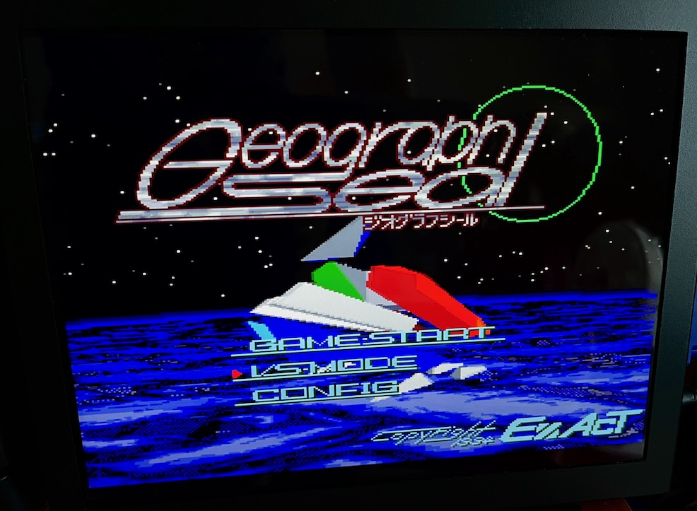
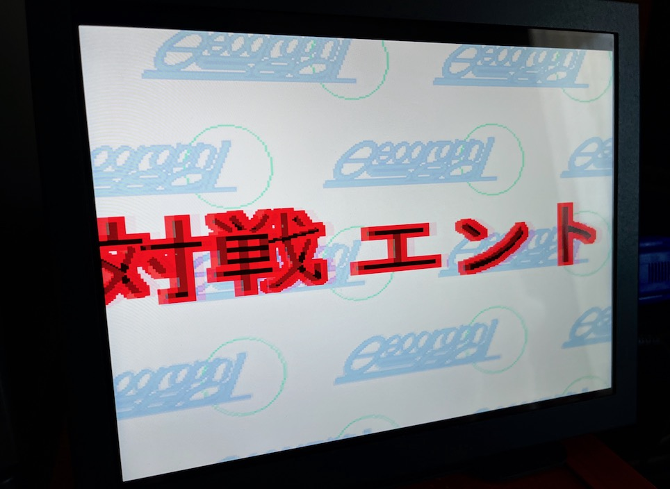
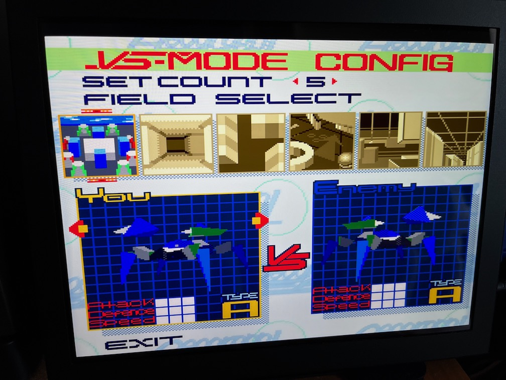
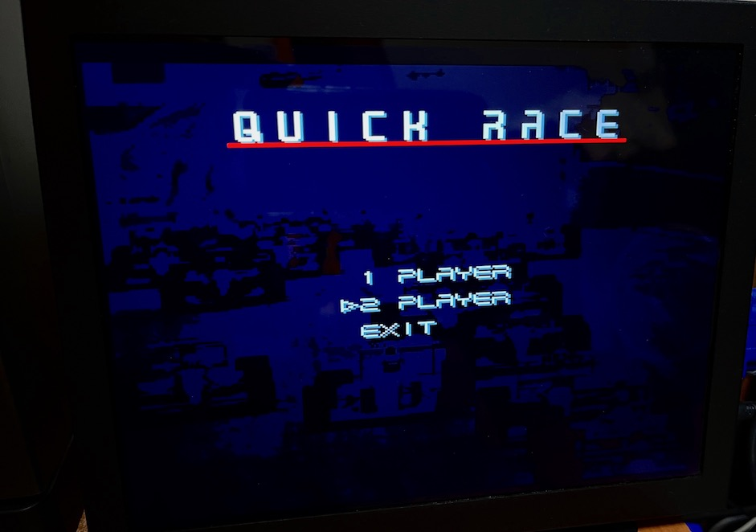
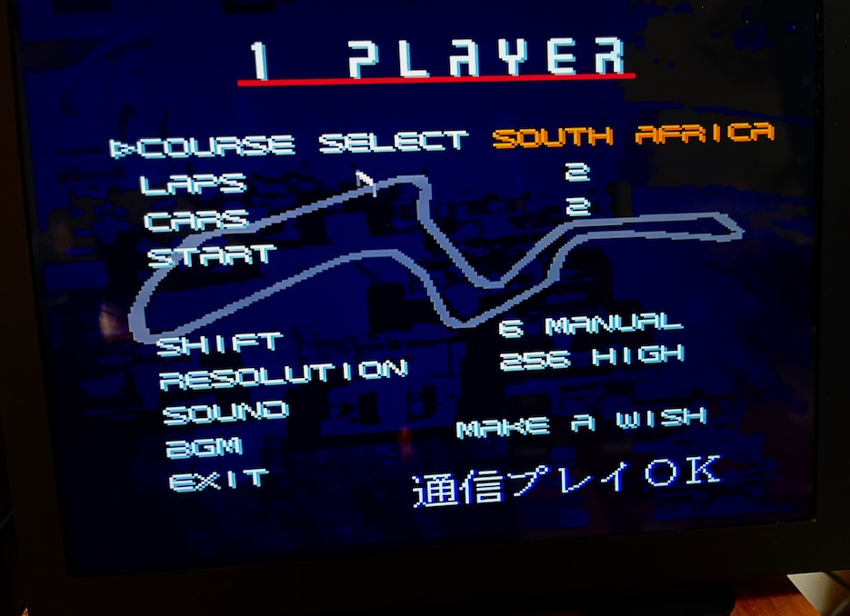
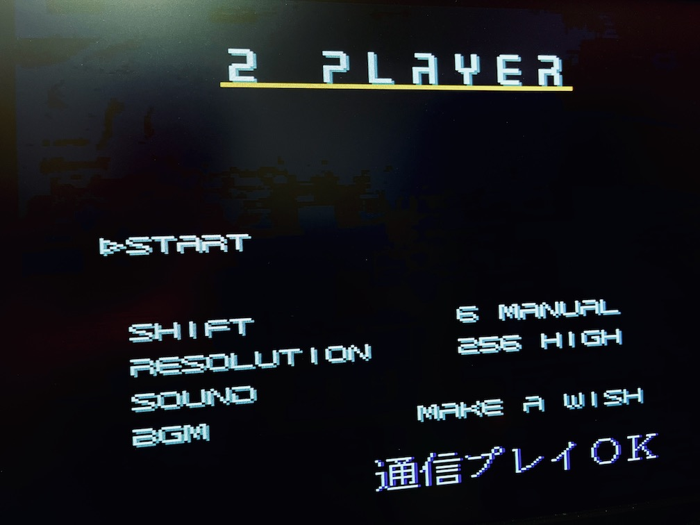

# serialudp

RS232C(UART) serial communication gateway over UDP in Python

---

## About This

これは1:1の RS232C(UART) シリアル通信を UDP を使ってIPネットワーク越しに行うためのゲートウェイサーバアプリケーションです。

Pythonで書かれているため、IPネットワークに接続されているPythonが動作する環境であればLinux,macOSなどOSを問わずに動かすことができます。ただし、Windows OSでは動作しないかもしれません。(selectorsモジュールを使っているため)

主たるユースケースとして、RS232Cクロス通信を使うレトロPCの通信対戦ゲームをLAN、あるいはインターネット越しに実現することを想定しています。(下図)

以下の説明では X680x0 のRS232Cクロス接続対戦ゲームを Raspberry Pi を使用してIPネットワーク越しに行う前提で記述してあります。適宜読み替えてください。

---

## 注意

このアプリケーションを利用してインターネット越しの通信を行う場合、相手方にグローバルIPとポート番号を伝える必要があります。
安易にSNSなどにグローバルIPやルータ・回線の種類などを書き込まないようにしましょう。攻撃の対象あるいは踏み台にされる可能性があります。

---

## 準備するもの

以下の構成が通信相手と自分と双方に必要です。

- ケーブル
  - RS232Cクロスケーブル(25pin-9pin)
  - USB-Serial変換ケーブル(FTDI社のチップセットを使っているもの)

FTDIチップセットはOVERTAKEの対戦を行う際には必須となります。

- Raspberry Pi 3A+/3B+/4B のいずれか (2/Zeroは所有していないので不明)
  - Raspberry Pi OS が導入済であること (最新の32bit OS Liteでのみ確認)
  - インターネットに接続されていること
  - USB-SerialおよびRS232CクロスケーブルでX680x0実機と接続されていること
  - `/dev/ttyUSB0` が見えていること

- X680x0 実機
  - RS232CクロスケーブルおよびUSB-SerialケーブルでRaspberry Piと接続されていること
  - 通信対戦をサポートした市販ゲームソフト

---

## インストール

Raspberry Pi にpiユーザでloginし、pipが導入されていなければ導入する。

    sudo apt-get install python3-pip

serialudp をこのGitリポジトリから導入する。

    pip install git+https://github.com/tantanGH/serialudp.git

コマンドラインで `serialudp` が使えることを確認する。

    serialudp -h

同じことを双方の Raspberry Pi で実施しておく。

---

## 使い方 (X680x0 ポピュラスの例)

まず双方の Raspberry Pi とX680x0の物理的なケーブルの接続を確認した後、serialudp サーバアプリケーションを立ち上げます。

    nohup serialudp -d /dev/ttyUSB0 -l 6830 192.168.1.5 6830 &

`-d` の後に指定するデバイス名は USB-Serial 変換アダプタのデバイス名になります。指定なしの場合のデフォルトは `/dev/ttyUSB0` です。

`-l` の後に自身が待ち受けを行うポート番号を指定します。指定なしの場合のデフォルトは 6830 です。

その後に相手方の IPアドレスとポート番号を指定します。相手方から入手してください。

例：Raspberry Pi (A) が 192.168.1.4, Raspberry Pi (B) が 192.168.1.5 の場合

- Raspberry Pi (A)で実行するコマンド

    nohup serialdup -d /dev/ttyUSB0 -l 6830 192.168.1.5 6830 &

- Raspberry Pi (B)で実行するコマンド

    nohup serialdup -d /dev/ttyUSB0 -l 6830 192.168.1.4 6830 &

あとはポピュラスのマニュアルにしたがって、データリンクモードで対戦セットアップを行います。

双方 Connect me を押してしばらくすると、接続が確立されるはずです。

終了する場合はポピュラスを終了した後に、serialudp のプロセスをkillしてください。

---

## 使い方 (X680x0 ジオグラフシールの例)

Raspberry Pi 上での serialudp の立ち上げについてはポピュラスと全く同じです。

タイトル画面で VS Mode を選択すると片方が対戦エントリー受付中になります。

もう片方でも VS Mode を選択すると対戦が開始されます。

注意：

上記のジオグラフシールの構成は以下で行いました。

- X68030/060turbo (68060 50.0MHz) + Raspberry 3B+
- X68000XVI (16.6MHz) + Raspberry Pi 4B

残念ながら X68000XVI + PhantomX の構成では、MPUモードを000にしたりウェイトを増やしてみたりしたのですが、VS modeを選択した瞬間にタイトル画面に戻ってしまいます。serialudp を起動していなかったり、RS232Cケーブルを接続していない場合はエラー音になるので、その状態よりは進んで一瞬対戦エントリー画面にはなるのですが。

有効な設定など見つけた方が居ましたらご一報ください。なお、ポピュラスは問題ありません。

---

## 使い方 (X680x0 OVERTAKEの例)

OVERTAKE は特殊な通信速度を使っているため、上記の設定だけでは動作しません。

まず、USB-Serial変換ケーブルがFTDIチップセットを使っていることが前提となります。PLチップセットでは以下の設定は使えません。

`setserial`を追加インストールします。

    sudo apt-get install setserial

`serialudp` を起動します。この時に `-s 38400` オプションをつけて起動します。

    nohup serialudp -s 38400 -d /dev/ttyUSB0 -l 6830 192.168.1.5 6830 &

現状のベースレートを確認します。

    sudo setserial -a /dev/ttyUSB0
    /dev/ttyUSB0, Line 0, UART: unknown, Port: 0x0000, IRQ: 0
      Baud_base: 24000000, close_delay: 50, divisor: 0
      closing_wait: 3000
      Flags: spd_normal

OVERTAKEはRS-MIDIと同じ31250bpsを使っているため、24000000 / 31250 = 768 を新たな divisor の値として設定します。

    sudo setserial /dev/ttyUSB0 spd_cust divisor 768

divisor が正しくセットされたことを確認します。

    sudo setserial -a /dev/ttyUSB0
    /dev/ttyUSB0, Line 0, UART: unknown, Port: 0x0000, IRQ: 0
      Baud_base: 24000000, close_delay: 50, divisor: 768
      closing_wait: 3000
      Flags: spd_cust

双方の Raspberry Pi で同じことを行います。

あとは QUICK RACE から 2 PLAYERS を選択すれば接続が確立するはずです。

本OVERTAKEの設定に関しては、以下の記事を参考にさせて頂きました。

- [https://yatte-mita.hateblo.jp/entry/2019/11/27/223957](https://yatte-mita.hateblo.jp/entry/2019/11/27/223957)

既に似たようなことを実践されていた方がいらっしゃったのを後になって知りました。(Java/TCPに対してPython/UDPという違いはありますが)
大変参考になりました。この場を借りてお礼申し上げます。

---

## 変更履歴

- 0.1.0 (2023/07/23) ... 初版

